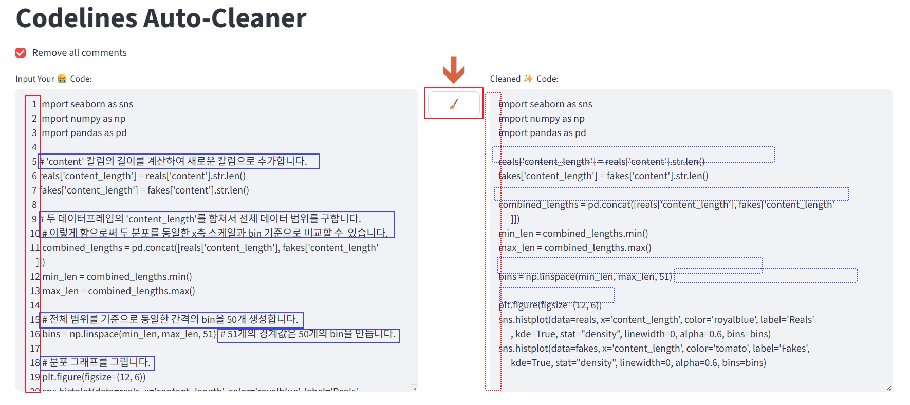

# codeline-remover
- ssh로 원격 서버에 붙어서 gemini cli를 사용할 경우, `/copy` 명령어가 안될 수도 있음. 터미널에 출력된 코드를 복붙해야 하는데, 모든 줄 앞에 line number가 붙어있음 -> 요걸 자동으로 제거하는 간단한 streamlit 기반 web ui를 만들었음
- 주석도 같이 제거함

## How-to-use:

1. activate venv
    ```
    source .venv/bin/activate
    ```

2. run streamlit
    ```
    streamlit run app.py
    ```

3. enter the web-site  
    `localhost:8501` (default url)

4. example  
    
